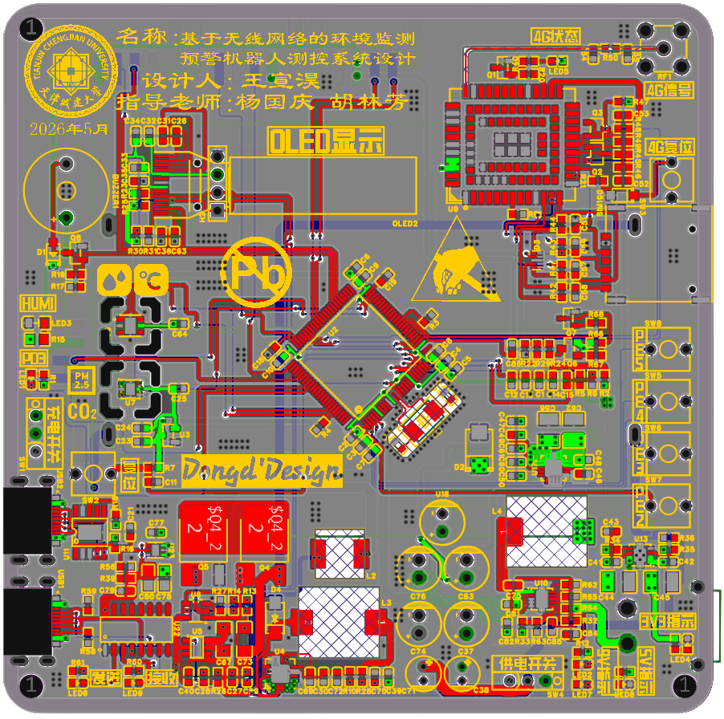
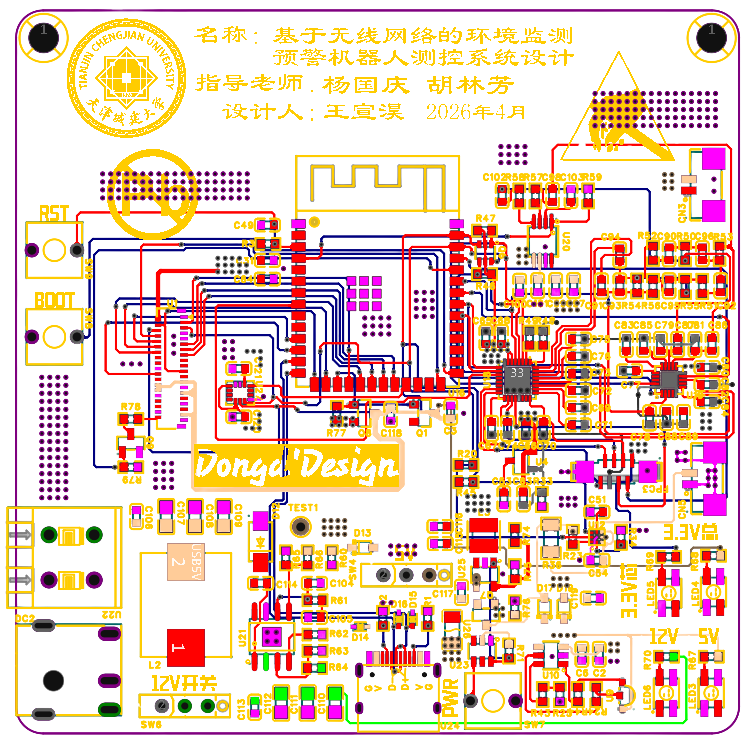
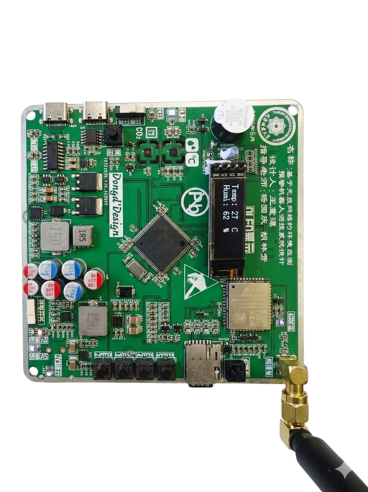
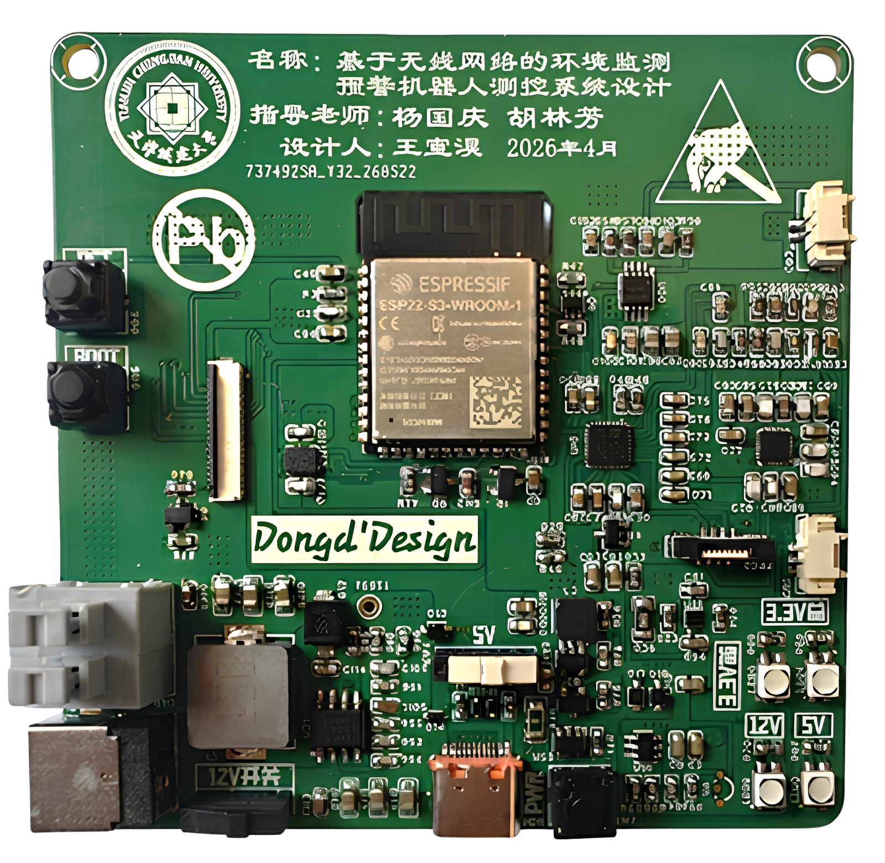

# Xuanhao Wang | 王宣淏

**Embedded AI / Robotics / PCB Hardware / IoT Systems**

Embedded and robotics developer with a Building Electrical and Intelligent Systems background. Graduated from Tianjin Chengjian University in 2026 (major rank 4/60); currently pursuing Control Science and Engineering at Beijing University of Civil Engineering and Architecture. I build complete prototypes that connect machine learning, MCU firmware, circuit design, PCB layout, sensing, actuation, cloud telemetry and robot motion.

> Curated from my resume, project reports, thesis, presentations and hardware evidence. Vendor SDKs, CMSIS, FreeRTOS and board packages are dependencies/reference material, not claimed as original work.

## Technical map

| Area | Technologies |
| --- | --- |
| Embedded | STM32F0/F1/F4, ESP32-S3, 51 MCU, C/C++, FreeRTOS, STM32 HAL, Keil, STM32CubeIDE |
| AI / vision | YOLOv5-Lite, ONNX Runtime, OpenCV, CNN, LSTM, time-series forecasting, edge deployment |
| Robotics | ROS, Jetson Orin NX Super, SLAM, EKF, sensor fusion, local planning, closed-loop chassis control |
| IoT | NB-IoT, EC801E 4G, BC28, HTTP POST, JSON, ThingsBoard, Alibaba Cloud IoT |
| Hardware | SHT30, SGP30, BH1750, CCS811, NTC, relays, fan/humidifier, lithium charging |
| PCB / tools | Lichuang EDA, schematic, PCB placement/routing, DC-DC/LDO, CH340C, Type-C, TP5100, Python, Linux, CAD, Onshape, ANSYS, COMSOL |

## Three main projects

### 1. Huiyan Shizhu: YOLO crop pest/disease inspection robot

2024.09-2024.11. A low-cost field robot combining Raspberry Pi vision inference, STM32 sensing/actuation and NB-IoT telemetry.

- YOLOv5 was slimmed by removing the Focus block and using YOLOv5-Lite; ONNX Runtime + OpenCV run the exported model on Raspberry Pi Linux.
- STM32F103C8T6 handles sensor acquisition, actuator control and device state; BC28/NB-IoT uploads data and receives cloud commands through Alibaba Cloud IoT.
- Senses air temperature, humidity, pressure, soil moisture and illumination; an open-hub wheel improves field mobility and crop protection.
- I owned the IoT data path, embedded YOLO deployment and control-layer integration, and supported mechanical/kinematic validation.
- Awards: provincial second prize in Tianjin New Engineering Practice Innovation Competition; first prize in the university Electronic Design Innovation Practice Competition; utility model patent application in 2025.

See [project-1-yolo](projects/project-1-yolo/README.md).

### 2. Zhijing Suiyu: LSTM+CNN indoor environment control robot

2024.11-2025.03. A closed loop from sensing to time-series prediction to fan/humidifier actuation, implemented on STM32 and custom PCBs.

- LSTM+CNN models temperature, humidity and CO2 sequences; the workflow includes preprocessing, windowing, train/validation/test splits, residual analysis and embedded tuning.
- Sensor, controller, power and actuator boards are separated for testability. STM32F1/F4 controls SHT30/SGP30 devices over I2C and drives PWM/relay outputs.
- Forecast-based feed-forward control anticipates environmental changes instead of relying only on static thresholds; periodic tasks and FreeRTOS organize the control layer.
- Cloud telemetry and dashboard plots expose temperature/humidity residuals for tuning and validation.
- Participated in a National Natural Science Foundation project proposal and R&D; invention patent application in 2025.

See [project-2-lstm](projects/project-2-lstm/README.md).

### 3. Thesis: wireless environmental monitoring and early-warning robot control system

2026.01-2026.06. Independently led a distributed multi-controller system for complex walls and special service environments, awarded Excellent Graduation Design at university level.

- Four layers: Edge (Jetson Orin NX Super), Control (STM32), Perception (SHT30/SGP30/depth camera/LiDAR) and Cloud (ThingsBoard).
- ROS fuses C32 multi-line LiDAR point clouds with Orbbec Gemini 2 depth streams. EKF handles time-space alignment and pose estimation for 3D SLAM and local obstacle planning.
- STM32F407VET6 gateway implements a surface/deep dual T/RH scheme and combines sliding window, temperature rate, static thresholds and trend fitting for anomaly localization and over-limit alarms.
- EC801E Cat-1 4G sends JSON telemetry by HTTP POST to ThingsBoard for cross-region transparent transmission, time-series storage and visual alarms.
- ESP32-S3-WROOM-2-N32R16V with dual microphones, ES7210 ADC and a 1.85-inch circular QSPI touch display provides local wake-up, sound-source localization, full-duplex voice interaction and LLM agent control.
- I designed, assembled and powered up the STM32F407 environmental IoT board and the ESP32-S3 AI voice board, including power tree, interfaces, placement and routing.

#### PCB and robot showcase

| Environmental IoT mainboard | AI voice board |
| --- | --- |
|  |  |
|  |  |

See [thesis](projects/thesis/README.md).

## Experience and awards

- Beijing Logic Technology | Intelligent Hardware Intern, 2026.02-2026.07: AI temperature-control wearable; 3D assembly validation, thermal-control PCB, component selection, MCU peripheral firmware porting and bring-up. Product exhibited at CES 2026 and entered partial delivery.
- Tianjin Chengjian University, Building Electrical and Intelligent Systems, BEng, 2022.09-2026.07, rank 4/60.
- CET-6; three consecutive years of university scholarships; Excellent Student and Excellent Graduate.
- Provincial second prize, Tianjin New Engineering Practice Innovation Competition; university first prize, Electronic Design Innovation Practice Competition; two Challenge Cup campus third prizes.

## Contact

- Email: 1614450904@qq.com
- Tel: 18203483370
- Interests: embedded AI, mobile robots, multi-sensor fusion, edge intelligence, PCB and control systems.
