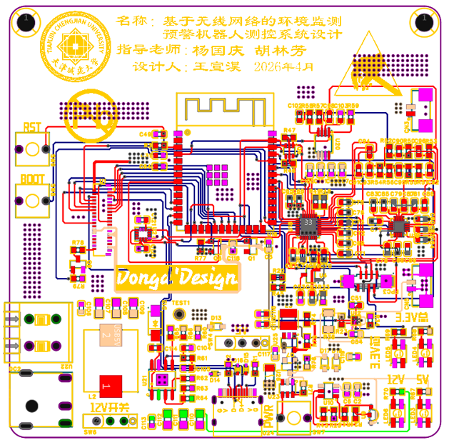
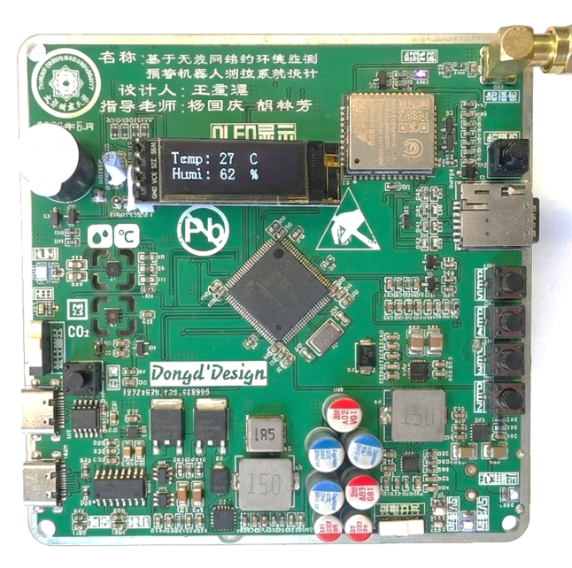
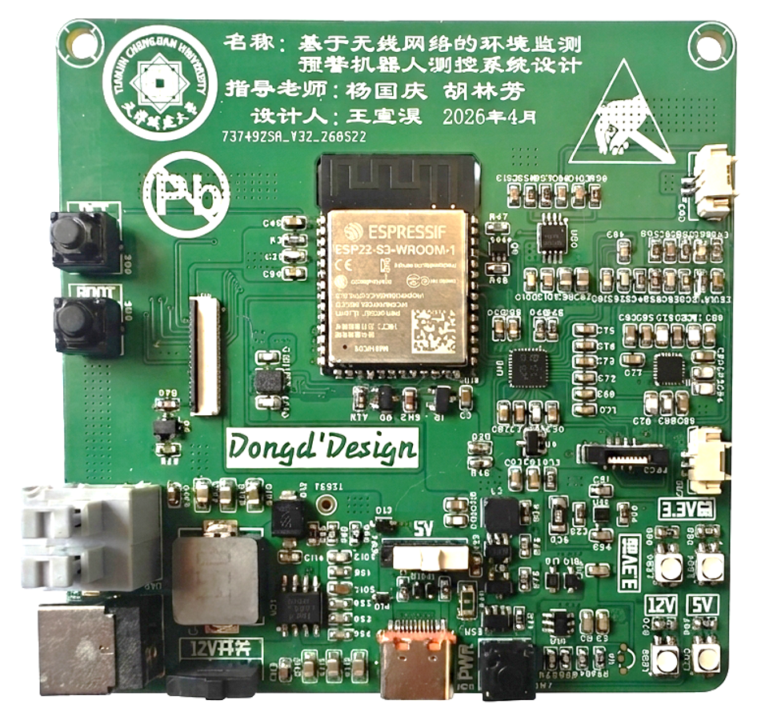
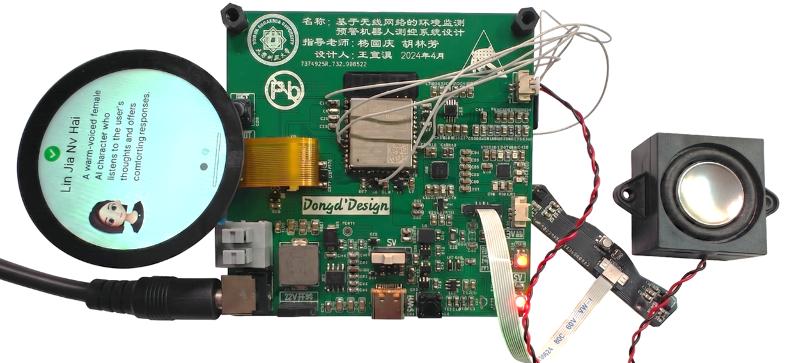
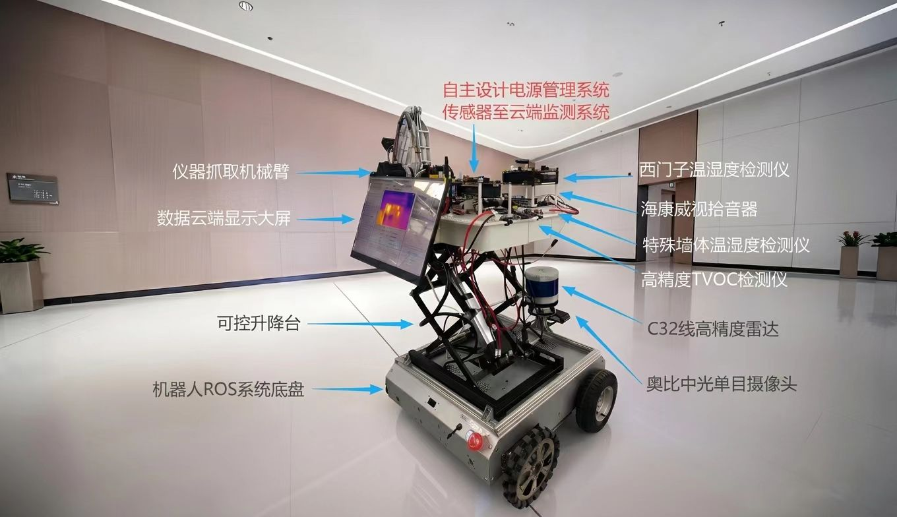

# Xuanhao Wang | 王宣淏

**Embedded AI / Robotics / PCB Hardware / IoT Systems**

Embedded AI and robotics developer focused on turning algorithms into working physical systems: MCU firmware, PCB hardware, sensing, actuation, edge inference, cloud telemetry and mobile robots. Graduated from Tianjin Chengjian University in 2026 (Building Electrical and Intelligent Systems, rank 4/60); currently pursuing an MSc in Control Science and Engineering at Beijing University of Civil Engineering and Architecture.

> This public portfolio is curated from my resume, project reports, thesis, presentations and hardware evidence. Vendor SDKs, CMSIS, FreeRTOS and board-support packages are dependencies/reference material, not claimed as original work. Contact details are limited to email.

## Start here

- [Beijing internship: AI wearable thermal-control hardware](experience/北京深镀科技-AI控温智能穿戴设备研发/README.md)
- [Project 1: 慧眼识株 agricultural inspection robot](projects/huiyan-shizhu-yolo-crop-pest-disease-inspection-robot/README.md)
- [Project 2: 智境·随驭 indoor environment control robot](projects/zhijing-suiyu-ai-indoor-environment-personalized-control-robot/README.md)
- [Graduation thesis: wireless environmental monitoring robot](projects/wireless-environmental-monitoring-early-warning-robot-control-system-thesis/README.md)

## Technical map

| Area | Technologies and engineering scope |
| --- | --- |
| Embedded | STM32F0/F1/F4, ESP32-S3, 51 MCU, C/C++, FreeRTOS, STM32 HAL, Keil, STM32CubeIDE, UART/I2C/SPI/PWM/ADC, board bring-up |
| AI / edge computing | YOLOv5-Lite, ONNX Runtime, OpenCV, CNN, LSTM, time-series forecasting, data windowing, residual analysis, Raspberry Pi Linux deployment |
| Robotics | ROS, Jetson Orin NX Super, LiDAR/depth-camera fusion, EKF, 3D SLAM, local obstacle planning, closed-loop chassis control |
| IoT / cloud | BC28 NB-IoT, EC801E Cat-1 4G, HTTP POST, JSON, ThingsBoard, Alibaba Cloud IoT, telemetry and remote-command paths |
| Hardware | SHT30, SGP30, BH1750, CCS811, NTC, relays, fans, humidifiers, TEC thermal modules, lithium charging and protection |
| Multiphysics simulation | COMSOL electromagnetic-field, electric-potential, electrothermal and CFD/TEC multiphysics simulation; ANSYS Fluent; CAD/Onshape geometry and thermal-flow verification |
| Scientific computing / AI | FEniCS finite-element solver, reduced-order modelling, latent-space acceleration, PINN, PINO, scientific ML and surrogate modelling |
| AI research tooling | ScienceRAG, MiroFish, Hermes, Codex and structured technical-research workflows; Vibe coding for rapid prototyping, evaluation and iteration |
| PCB / engineering tools | Lichuang EDA, schematic capture, placement/routing, power-tree design, DC-DC/LDO, Type-C, CH340C, Python and Linux |

## Portfolio at a glance

| Work | Engineering loop | Core stack | Primary evidence |
| --- | --- | --- | --- |
| 慧眼识株 | Visual inspection -> embedded decision -> actuation -> NB-IoT telemetry | YOLOv5-Lite, ONNX Runtime, Raspberry Pi, STM32F103, BC28 | Detection result, robot prototype, architecture |
| 智境·随驭 | Multi-sensor sampling -> LSTM+CNN forecast -> feed-forward control | STM32F405, SHT30/SGP30, FreeRTOS, custom PCBs | Sensor/power/actuator PCBs, dashboard, architecture |
| 毕业设计 | 3D perception + environmental monitoring + cloud alarm + voice HMI | ROS, Jetson Orin NX, LiDAR/depth camera, STM32F407, ESP32-S3, 4G | Robot system, annotated system map, PCB assemblies |
| 北京深镀实习 | Multiphysics model -> fast scientific solve -> TEC/airflow hardware iteration | COMSOL, Fluent, FEniCS, ROM/latent space, PINN/PINO, PCB | CAD, CFD, thermal-control PCB, wearable layout |

## Beijing industry experience

### 北京深镀科技 | 智能硬件实习生

**2026.02-2026.07 | AI 控温智能穿戴设备研发**

Worked on an AI-controlled wearable thermal-management product that uses multi-modal sensing and thermoelectric/airflow hardware to form a temperature-control loop. The product was exhibited at CES 2026 and entered partial delivery.

- **Mechanical integration:** completed 3D assembly modelling and feasibility validation for the wearable structure; coordinated component placement, air-path packaging and thermal-design constraints with mechanical and hardware work.
- **PCB implementation:** designed the thermal-control board from schematic and component/interface definition through PCB placement and routing; supported practical assembly and power-on work.
- **Firmware bring-up:** ported, compiled and performed baseline debugging for MCU peripheral and temperature-control closed-loop code.
- **Thermal verification:** participated in airflow/thermal design iteration using CAD assemblies and ANSYS Fluent simulation evidence.
- **Multiphysics simulation:** built COMSOL workflows for electromagnetic field, electric-potential, electrothermal and CFD/TEC cases, connecting device geometry, material parameters, heat sources and boundary conditions.
- **Scientific-computing App:** developed a TEC simulation App with FEniCS as the finite-element backend; used reduced-order modelling and latent-space representations to accelerate repeated design-space solves.
- **Neural operators and scientific AI:** explored PINN/PINO surrogates and physics-informed learning for field reconstruction, parameter sweeps and fast thermal-response estimation.
- **Research engineering:** used ScienceRAG and MiroFish for technical knowledge organization, scenario analysis and experiment planning; used Hermes and Codex for Vibe coding, debugging, refactoring and rapid validation.
- **Scope note:** product schematics, production firmware and commercial data are proprietary and are not included in this public repository.

**Engineering emphasis:** the internship work connects geometry and multiphysics assumptions to manufacturable PCB hardware, embedded bring-up and a scientific-computing App. The public evidence is intentionally limited to non-confidential images and technical summaries.

<table>
  <tr>
    <th width="65%">Industry application context</th>
    <th width="35%">Wearable sensor/airflow layout</th>
  </tr>
  <tr>
    <td width="65%"></td>
    <td width="35%" align="center"></td>
  </tr>
</table>

| Wearable CAD assembly (retained) | Fluent thermal-flow simulation (retained) |
| --- | --- |
|  |  |

| Thermal simulation overview | Thermal simulation detail |
| --- | --- |
|  |  |

<table>
  <tr>
    <th width="50%">Thermal-control board front (cropped)</th>
    <th width="50%">Thermal-control board under test (cropped)</th>
  </tr>
  <tr>
    <td></td>
    <td></td>
  </tr>
</table>

See the [Beijing internship technical summary](experience/北京深镀科技-AI控温智能穿戴设备研发/README.md).

## Three main projects

### 1. “慧眼识株”–基于YOLO机器视觉农作物病虫害智能识别监测预警农保机器人

**2024.09-2024.11 | YOLO crop pest/disease inspection and early-warning agricultural-protection robot**

Designed as a low-cost field robot that joins Raspberry Pi vision inference, STM32 sensing/actuation and NB-IoT connectivity for crop disease/pest inspection.

- **Vision pipeline:** reduced YOLOv5 by removing the Focus block and adopted YOLOv5-Lite; exported inference runs with ONNX Runtime and OpenCV on Raspberry Pi Linux.
- **Control and sensing:** STM32F103C8T6 performs sensor acquisition, actuator control, device-state handling and serial debugging. The sensing set covers air temperature, humidity, pressure, soil moisture and illumination.
- **IoT path:** BC28 NB-IoT forwards telemetry and receives cloud commands through Alibaba Cloud IoT, connecting the field platform to remote supervision.
- **My contribution:** owned IoT data-path work, embedded YOLO deployment and control-layer integration; supported robot appearance, inverse kinematics and mechanical-stability validation.
- **Outcome:** provincial second prize in the Tianjin New Engineering Practice Innovation Competition; first prize in the university Electronic Design Innovation Practice Competition; utility-model patent application in 2025.

| Edge-vision architecture | Field robot prototype |
| --- | --- |
|  |  |

*Evidence reading order: architecture shows the deployment path; the detection image shows the edge-vision output; the robot image shows the physical integration.*

See [“慧眼识株”项目资料](projects/huiyan-shizhu-yolo-crop-pest-disease-inspection-robot/README.md).

### 2. 科技发明制作-12-智境·随驭-AI 驱动的室内环境个性化调控机器人

**2024.11-2025.03 | LSTM+CNN indoor environment personalization and control robot**

Built a sensing-prediction-actuation control loop on custom PCBs and STM32 controllers. The project shifts control from a static-threshold response toward forecast-based feed-forward regulation.

- **Prediction model:** LSTM+CNN models temperature, humidity and CO2 time series. The training workflow includes preprocessing, windowing, normalization, train/validation/test splits and residual analysis.
- **Multi-board hardware:** sensor, controller, power and fan/humidifier actuator boards are separated for testability and noise isolation. STM32F1/F4 control SHT30/SGP30 over I2C and drive PWM/relay outputs.
- **Control software:** periodic tasks and FreeRTOS organize acquisition, control and fault handling; forecast output is used to anticipate environmental change rather than only react after an over-limit event.
- **My contribution:** independently completed mobile-chassis development, multi-sensor circuit integration, PCB design, MCU programming and end-to-end commissioning; deployed and tuned the LSTM+CNN prediction workflow.
- **Outcome:** contributed to a 2025 National Natural Science Foundation proposal/R&D effort; invention-patent application filed in 2025.

| Sensor PCB | Power PCB | Fan/humidifier actuator PCB |
| --- | --- | --- |
|  |  |  |

| System architecture | Cloud dashboard |
| --- | --- |
|  |  |

*Evidence reading order: the three PCB images show modular hardware ownership; the architecture image shows data/control boundaries; the dashboard shows telemetry and tuning visibility.*

See [智境·随驭项目资料](projects/zhijing-suiyu-ai-indoor-environment-personalized-control-robot/README.md).

### 3. 基于无线网络的环境监测预警机器人测控系统设计

**2026.01-2026.06 | Undergraduate thesis | University-level Excellent Graduation Design**

Independently led the full-stack design of a distributed inspection robot for complex walls and special service environments. The delivered system combines 3D perception, multi-sensor environmental monitoring, 4G alarms, autonomous navigation and an on-device AI voice interface.

- **Four-layer topology:** Jetson Orin NX Super for edge decision-making; STM32 control nodes; SHT30/SGP30, depth-camera and LiDAR perception; ThingsBoard cloud telemetry and alarms.
- **Robot software:** ROS fuses C32 multi-line LiDAR point clouds and Orbbec Gemini 2 depth streams. EKF manages time-space alignment and pose estimation for 3D SLAM and local obstacle planning.
- **Environmental monitoring:** an STM32F407VET6 gateway uses surface/deep dual temperature-humidity sensing. Sliding windows, temperature rate, static thresholds and trend fitting support anomaly localization and over-limit alarms.
- **Wide-area connectivity:** EC801E Cat-1 4G publishes JSON telemetry by HTTP POST to ThingsBoard for remote time-series storage, visualization and alarm delivery.
- **Voice HMI:** ESP32-S3-WROOM-2-N32R16V, dual microphones, ES7210 ADC and a 1.85-inch circular QSPI touch display provide wake-up, sound-source localization, full-duplex interaction and LLM-agent control. FreeRTOS supports the long-lived edge connection.
- **My contribution:** designed, assembled and powered up the STM32F407 environmental IoT mainboard and ESP32-S3 AI voice board, including power-tree design, interfaces, component placement and routing; developed the sensor and voice-system lower-layer code.

#### PCB and robot showcase

| Environmental IoT mainboard | AI voice multimodal board |
| --- | --- |
|  |  |
|  |  |

*Evidence reading order: the annotated system image maps physical modules; the PCB images expose board-level implementation; the ROS architecture and thesis document describe the software and test basis.*

See [毕业设计项目资料](projects/wireless-environmental-monitoring-early-warning-robot-control-system-thesis/README.md).

## Education and recognition

- Beijing University of Civil Engineering and Architecture, Control Science and Engineering, MSc, 2026.07-present.
- Tianjin Chengjian University, Building Electrical and Intelligent Systems, BEng, 2022.09-2026.07, major rank 4/60.
- CET-6; university scholarships in three consecutive years; Excellent Student and Excellent Graduate.
- Provincial second prize, Tianjin New Engineering Practice Innovation Competition; university first prize, Electronic Design Innovation Practice Competition; two Challenge Cup campus third prizes.

## Contact

- Email: 1614450904@qq.com
- Interests: embedded AI, mobile robots, multi-sensor fusion, edge intelligence, PCB and control systems.
