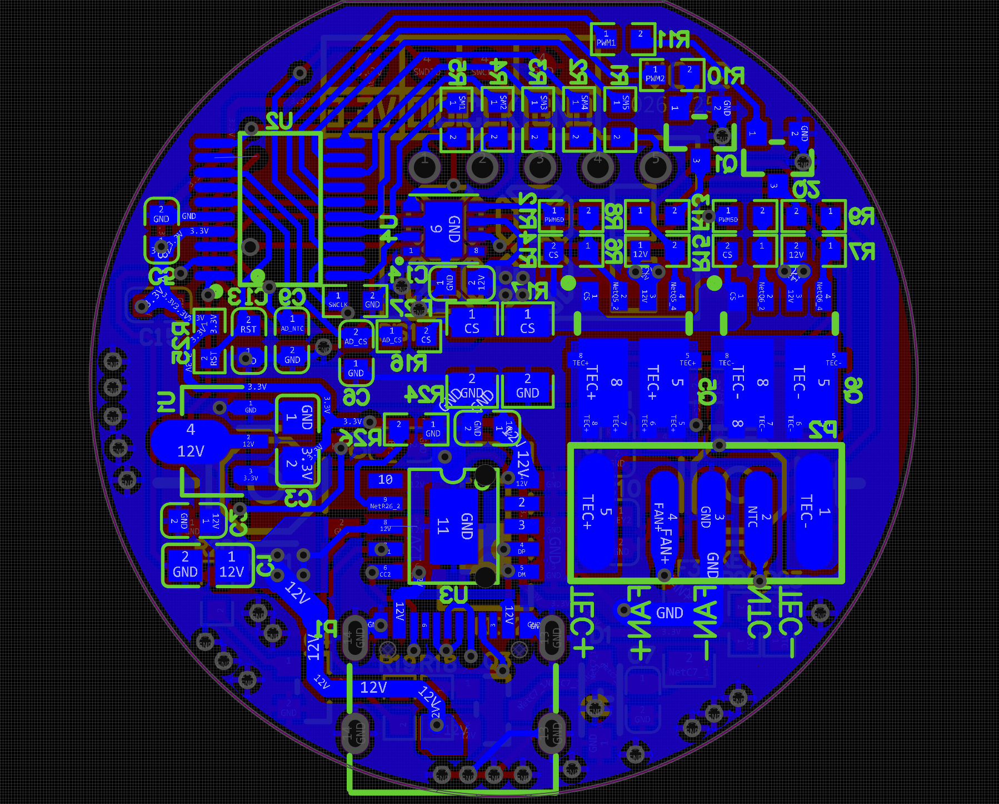
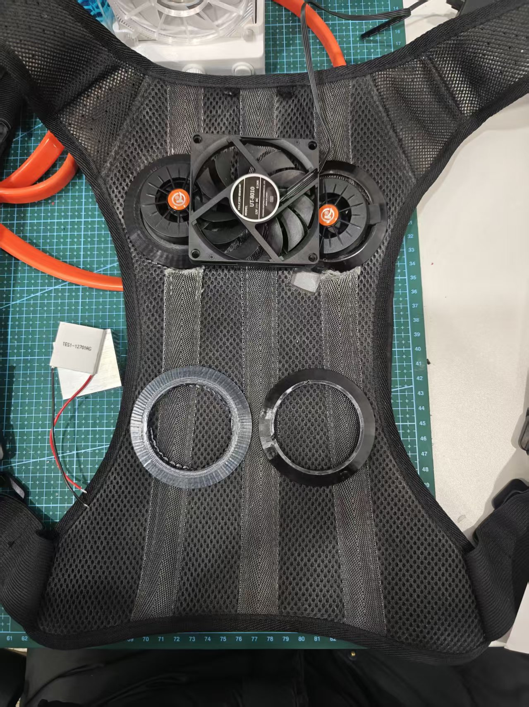

# 北京深镀科技 | AI 控温智能穿戴设备研发

## Role and scope

**Intelligent Hardware Intern | 2026.02-2026.07**

Contributed to the development of an AI-controlled wearable thermal-management product. The product combines temperature/humidity and other multi-modal inputs with thermoelectric and airflow hardware to support automatic temperature regulation. It was exhibited at CES 2026 and entered partial delivery.

## Engineering contribution

1. **Mechanical and thermal integration** - built and verified 3D assemblies; aligned device packaging, component placement and thermal constraints with the mechanical/hardware team.
2. **Thermal-control PCB** - completed the control-board schematic/PCB work, component selection and interface definitions; supported manufacturing-facing assembly and power-on validation.
3. **Embedded bring-up** - ported, compiled and performed basic debugging for MCU peripherals and thermal closed-loop control code.
4. **Prototype iteration** - supported wearable prototype assembly and fan/TEC system integration; used CAD and CFD evidence in design iteration.

## Public evidence

| Thermal-control PCB layout | Wearable prototype |
| --- | --- |
|  |  |

| Wearable CAD assembly | Airflow/thermal CFD simulation |
| --- | --- |
|  |  |

## Confidentiality

This page is a non-confidential technical summary based on the internship evidence and resume. Commercial product schematics, source firmware, manufacturing files, customer information and performance data are not included.
