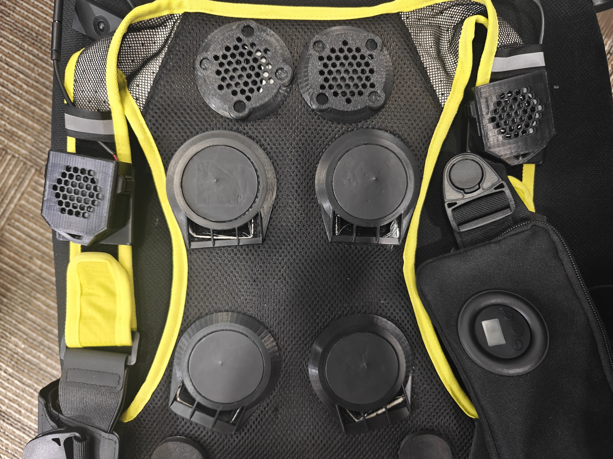
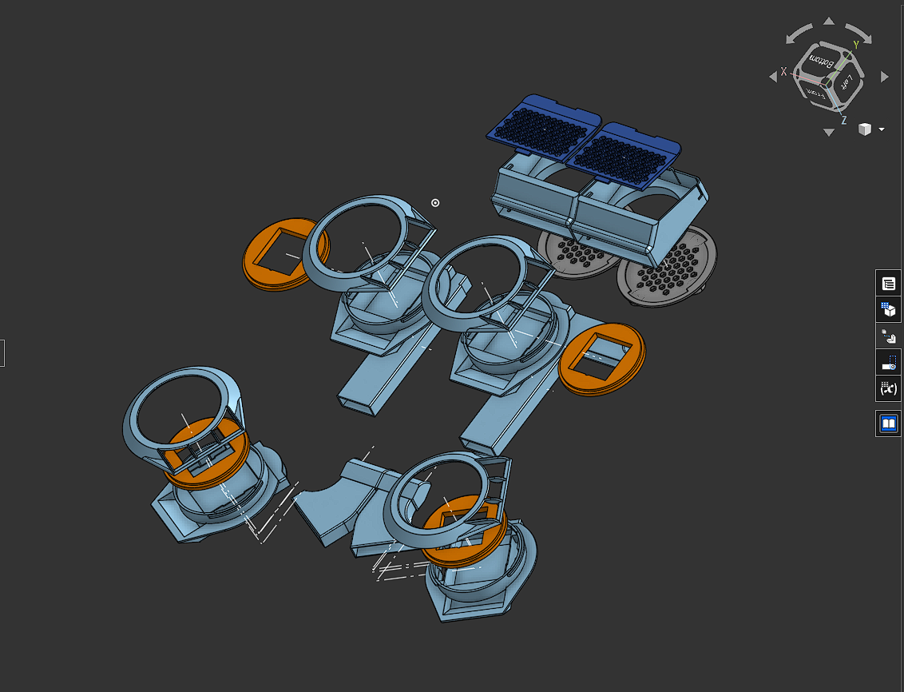
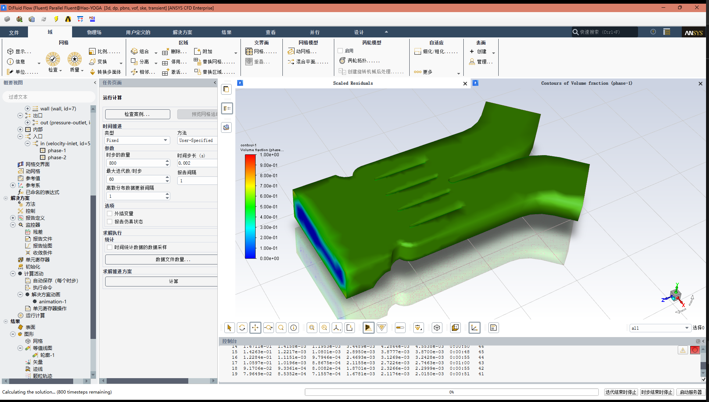
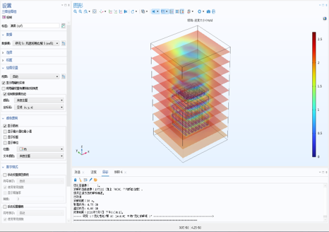
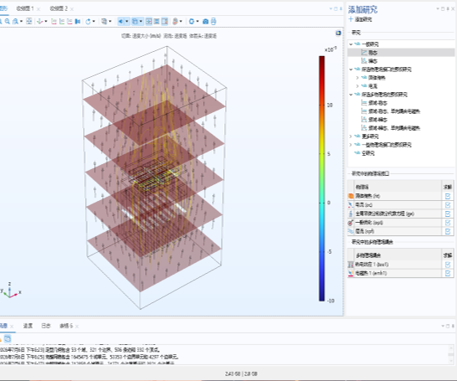
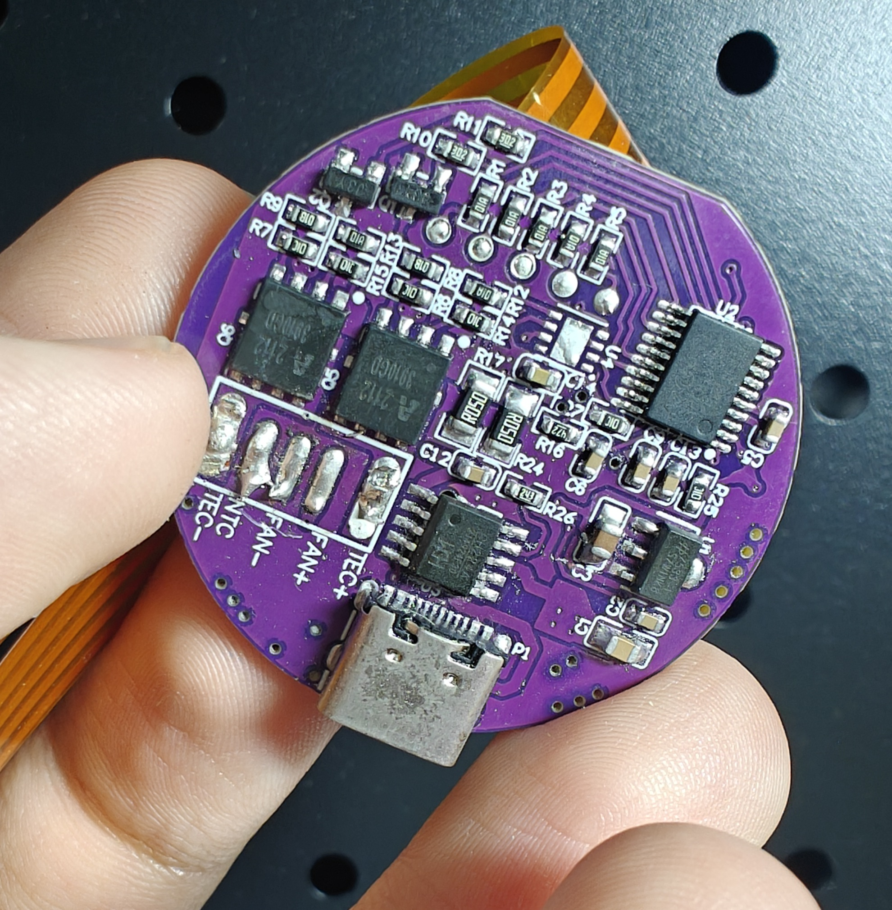
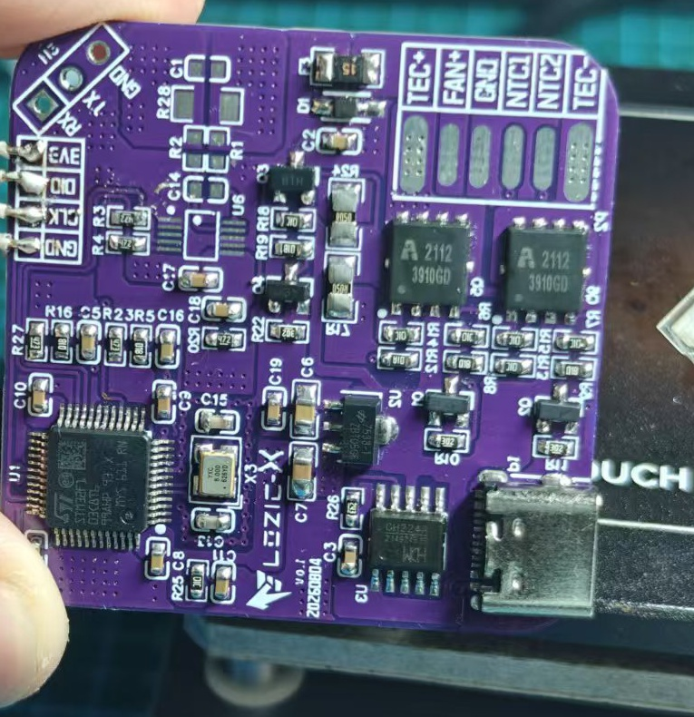

# 北京深镀科技 | AI 控温智能穿戴设备研发

## Role and scope

**Intelligent Hardware Intern | 2026.02-2026.07**

Contributed to the development of an AI-controlled wearable thermal-management product. The product combines temperature/humidity and other multi-modal inputs with thermoelectric and airflow hardware to support automatic temperature regulation. It was exhibited at CES 2026 and entered partial delivery.

## Engineering contribution

1. **Mechanical and thermal integration** - built and verified 3D assemblies; aligned device packaging, component placement and thermal constraints with the mechanical/hardware team.
2. **Thermal-control PCB** - completed the control-board schematic/PCB work, component selection and interface definitions; supported manufacturing-facing assembly and power-on validation.
3. **Embedded bring-up** - ported, compiled and performed basic debugging for MCU peripherals and thermal closed-loop control code.
4. **Prototype iteration** - supported wearable prototype assembly and fan/TEC system integration; used CAD and CFD evidence in design iteration.

## New skills developed during the internship

### COMSOL multiphysics and TEC simulation

- Electromagnetic-field and electric-potential modelling for coupled device behaviour.
- Electrothermal coupling for TEC modules, including Joule heating, Peltier heat transfer, thermal conduction and boundary-condition setup.
- CFD and conjugate heat-transfer analysis for airflow channels, heat sinks, fans and wearable thermal paths.
- Parameterized geometry/material/boundary-condition studies for design comparison and thermal-management iteration.

### FEniCS-based TEC simulation App

Built a TEC simulation App with FEniCS as the finite-element solving layer. To make repeated interactive studies practical, the workflow combines reduced-order modelling with latent-space representations, allowing the App to approximate or accelerate expensive multiphysics solves while retaining a physics-based solver path for reference and correction.

### Physics-informed scientific AI

Applied or studied PINN and PINO approaches for physics-constrained field reconstruction, surrogate modelling and fast parameter-sweep prediction. These methods connect PDE residuals, boundary conditions and measured/simulated data instead of treating the TEC field as a purely black-box regression task.

### Research and Vibe coding workflow

Comfortable using ScienceRAG and MiroFish for technical literature/knowledge organization and scenario analysis, and Hermes/Codex for Vibe coding, rapid implementation, debugging, refactoring and iterative validation of scientific-computing tools.

## Public evidence

<table>
  <tr>
    <th width="65%">Industry application context</th>
    <th width="35%">Wearable sensor/airflow layout</th>
  </tr>
  <tr>
    <td width="65%"></td>
    <td width="35%" align="center"></td>
  </tr>
</table>

| Wearable CAD assembly (retained) | Fluent thermal-flow simulation (retained) |
| --- | --- |
|  |  |

| Thermal simulation overview | Thermal simulation detail |
| --- | --- |
|  |  |

<table>
  <tr>
    <th width="50%">Thermal-control board front (cropped)</th>
    <th width="50%">Thermal-control board under test (cropped)</th>
  </tr>
  <tr>
    <td></td>
    <td></td>
  </tr>
</table>

## Confidentiality

This page is a non-confidential technical summary based on the internship evidence and resume. Commercial product schematics, source firmware, manufacturing files, customer information and performance data are not included.
