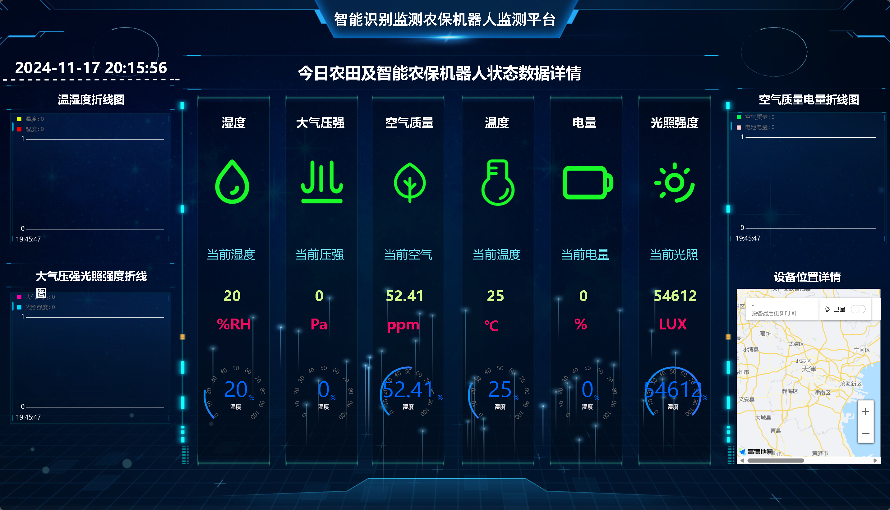
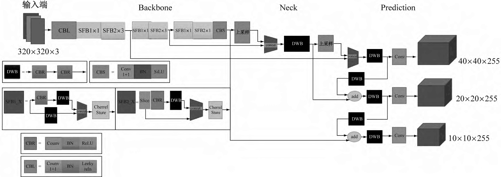
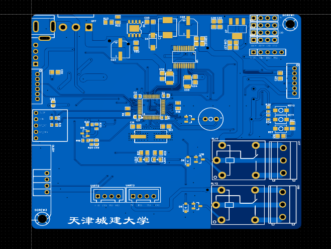

# “慧眼识株”–基于YOLO机器视觉农作物病虫害智能识别监测预警农保机器人

**Huiyan Shizhu | YOLO crop pest/disease inspection and early-warning agricultural-protection robot**

## Problem

Field pest/disease inspection needs mobility, edge vision, environmental sensing and remote supervision. This prototype combines all four in a low-cost agricultural protection robot.

## Architecture

Camera -> Raspberry Pi/Linux -> YOLOv5-Lite -> ONNX Runtime + OpenCV
STM32F103C8T6 <- sensors/actuators -> BC28 NB-IoT -> Alibaba Cloud IoT

## Implementation

1. YOLOv5 was slimmed by removing Focus and using YOLOv5-Lite. The exported ONNX model runs with ONNX Runtime and OpenCV on Raspberry Pi Linux.
2. STM32F103C8T6 owns sensor sampling, actuator drivers, state machine and serial debug. BC28 carries telemetry and cloud commands over NB-IoT.
3. The sensing set covers air temperature, humidity, pressure, soil moisture and illumination. The open-hub wheel improves mobility in soft fields.
4. I worked across the IoT link, embedded inference deployment, control integration and mechanical/kinematic validation.

## My role

- Built the IoT telemetry and remote-command integration path.
- Deployed and optimized the exported YOLO model for Raspberry Pi edge inference.
- Integrated the STM32 control layer with sensing, actuation and serial-debug workflows.
- Supported appearance/structure work, inverse kinematics and stability validation for the field robot.

## Evidence

## Deliverables

- [design-spec.docx](design-spec.docx): design specification, hardware/software/test sections and photo evidence.
- [presentation.pptx](presentation.pptx): project presentation.
- The source folder also contains patent notices and a demo video; large binaries are intentionally kept out of the profile repository.

## Outcome

Provincial second prize in Tianjin New Engineering Practice Innovation Competition; first prize in the university Electronic Design Innovation Practice Competition; utility model patent application in 2025.
