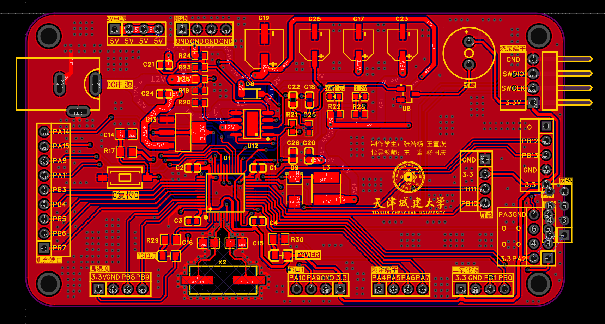
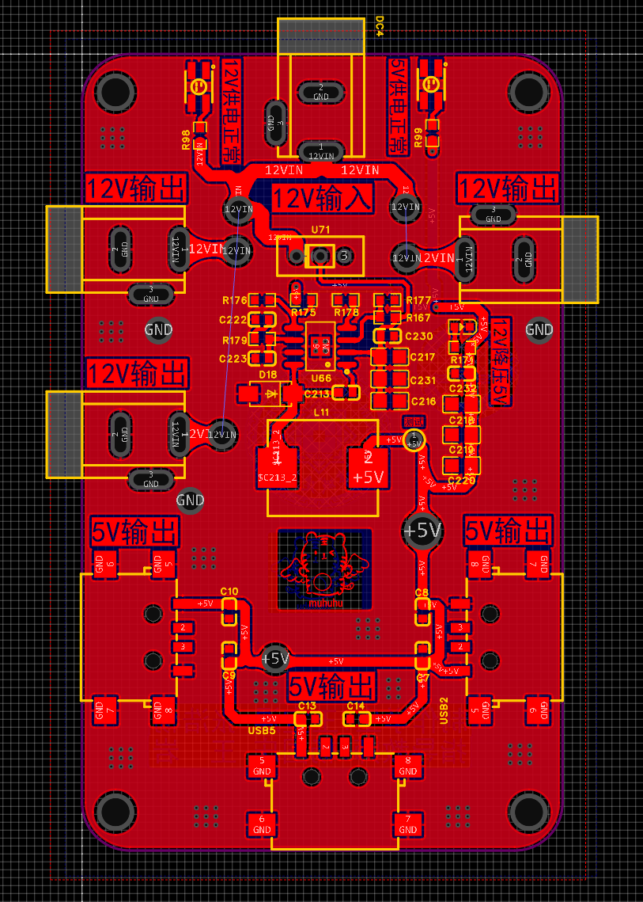
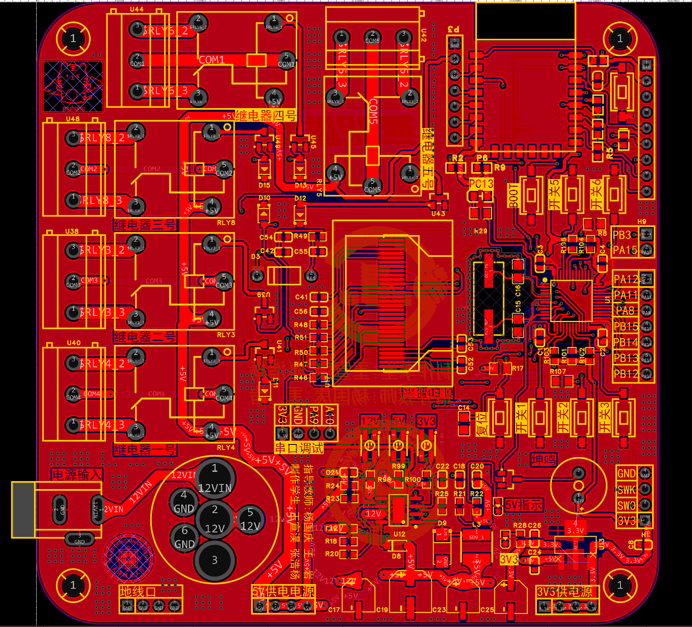
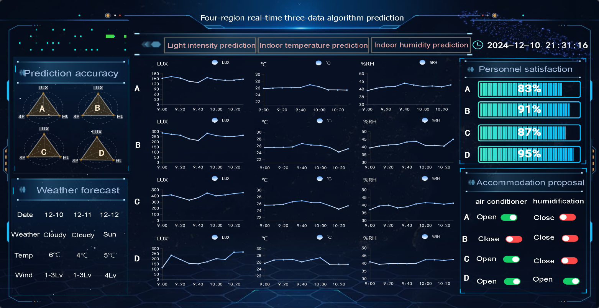

# Zhijing Suiyu: LSTM+CNN indoor environment control robot

## Overview

Closed-loop robot from sensing to time-series forecasting to fan/humidifier actuation. Forecasts are used as feed-forward control to reduce the lag of static threshold rules.

## Engineering details

- LSTM+CNN models temperature, humidity and CO2 sequences with windowing, normalization, train/validation/test splits and residual analysis.
- STM32F405RGT6 handles sensor polling, periodic tasks, serial protocol, PWM outputs and fault states. SHT30/SGP30 use I2C.
- Sensor, power and actuator boards are separated for testability. Power and control zones reduce actuator noise in sampled data.
- Cloud telemetry and dashboard plots expose prediction residuals for tuning and validation.

## PCB showcase

## Source snapshot

- [main_stm32f405.c](main_stm32f405.c): STM32F405 application entry.
- [sgp30.c](sgp30.c) / [sgp30.h](sgp30.h): SGP30 CO2/TVOC driver.
- [robot-manual.pdf](robot-manual.pdf): system manual.

## Outcome

Participated in a National Natural Science Foundation project proposal and R&D; invention patent application in 2025.
