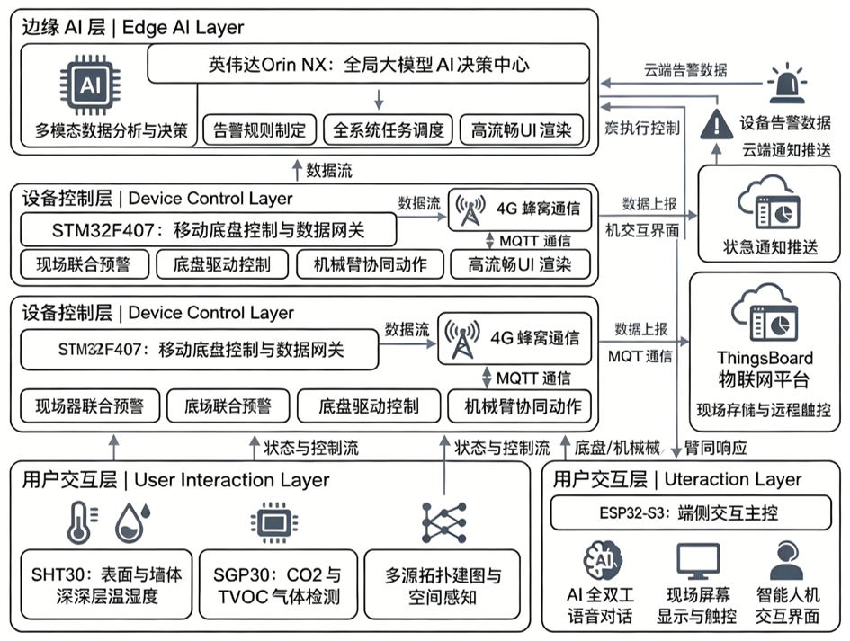

# 基于无线网络的环境监测预警机器人测控系统设计

**Undergraduate thesis | Wireless environmental monitoring and early-warning robot control system**

## Project statement

Mobile robot control system for complex walls and special service environments. The design integrates autonomous inspection, environmental sensing, anomaly warnings, 4G cloud telemetry and AI voice interaction.

## Distributed architecture

Jetson Orin NX Super (edge decision)
ROS: C32 LiDAR + Orbbec Gemini 2 + EKF -> 3D SLAM / obstacle planning
STM32 chassis controller -> closed-loop motion / independent suspension
STM32F407VET6 IoT gateway -> SHT30 + SGP30 + dual T/RH sensing -> EC801E 4G -> HTTP POST JSON -> ThingsBoard
ESP32-S3 voice HMI -> dual mic + ES7210 + QSPI touch -> LLM agent

## End-to-end data path

`LiDAR/depth camera -> ROS time-space alignment and EKF -> 3D SLAM/local planning -> chassis control`

`SHT30/SGP30 + dual T/RH -> STM32F407 anomaly logic -> EC801E 4G -> HTTP POST JSON -> ThingsBoard alarms`

`dual microphones + ES7210 + QSPI touch -> ESP32-S3 FreeRTOS interaction -> voice/LLM-agent command path`

## Hardware design

### Environmental IoT mainboard

- STM32F407VET6 minimum system, external clock, hardware reset and programming/debug interface.
- SHT30 temperature/humidity and SGP30 CO2/TVOC sensing over I2C.
- CH224K Type-C input, TP5100 lithium charging, battery protection/balancing.
- TPS54335 buck stage plus TLV76701/TPS7A8300/TPS7A8001 LDO regulation.
- EC801E Cat-1 4G, CH340C debug/programming serial and OLED status UI.

### AI voice multimodal board

- ESP32-S3-WROOM-2-N32R16V edge controller.
- Dual-microphone array, ES7210 audio ADC, local wake-up and sound-source localization.
- 1.85-inch circular QSPI touch display and audio path for full-duplex interaction.

## Software and algorithms

- ROS nodes for asynchronous multi-sensor communication and navigation.
- EKF for time-space alignment, odometry and pose estimation.
- 3D SLAM and local obstacle planning in unstructured environments.
- Surface/deep dual T/RH sensing for hidden spaces.
- Sliding window + temperature rate + static thresholds + trend fitting for anomaly localization and over-limit alarms.
- 1 s periodic acquisition, OLED page rotation, sensor calibration and HTTP POST JSON telemetry.
- FreeRTOS-based long-lived full-duplex voice interaction and LLM agent control on ESP32-S3.

## Validation focus

- Powered up and commissioned both custom boards, including regulated power rails, programming/debug interfaces, sensors and display/audio peripherals.
- Used synchronized perception streams and EKF-based pose estimation as the basis for SLAM and local obstacle planning.
- Checked the monitoring path with periodic acquisition, calibration, sliding-window trend logic and remote alarm delivery.
- Evaluated the voice path as a long-lived FreeRTOS interaction rather than a one-shot demo.

## My role

- Independently led the end-to-end hardware and software development.
- Designed, routed, assembled and powered up the environmental IoT mainboard and AI voice multimodal board.
- Developed lower-layer sensing and voice-interaction software, and integrated ROS mapping/navigation, 4G telemetry and cloud alarms.

## Evidence

## Deliverables

- [thesis.pdf](thesis.pdf): full thesis with hardware, software, algorithms and tests.
- [thesis-board.pdf](thesis-board.pdf): project exhibition board.

## Result

Delivered the inspection robot and multi-board hardware. The system demonstrates centimeter-level SLAM, autonomous obstacle avoidance, 4G ThingsBoard alarms and full-duplex voice interaction in noisy environments. Awarded Excellent Graduation Design at university level and recommended for Tianjin outstanding thesis/design selection.
