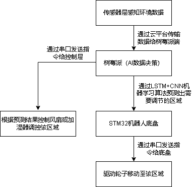

# 科技发明制作-12-智境·随驭-AI 驱动的室内环境个性化调控机器人

**Zhijing Suiyu | LSTM+CNN indoor environment personalization and control robot**

## Overview

Closed-loop robot from sensing to time-series forecasting to fan/humidifier actuation. Forecasts are used as feed-forward control to reduce the lag of static threshold rules.

## Control loop

`SHT30/SGP30 sampling -> windowing and normalization -> LSTM+CNN forecast -> forecast-aware control decision -> PWM/relay actuation -> telemetry/dashboard`

The separation between sensor, power and actuator boards makes it possible to isolate switching noise, replace one module during bring-up and compare prediction residuals during tuning.

## Engineering details

- LSTM+CNN models temperature, humidity and CO2 sequences with windowing, normalization, train/validation/test splits and residual analysis.
- STM32F405RGT6 handles sensor polling, periodic tasks, serial protocol, PWM outputs and fault states. SHT30/SGP30 use I2C.
- Sensor, power and actuator boards are separated for testability. Power and control zones reduce actuator noise in sampled data.
- Cloud telemetry and dashboard plots expose prediction residuals for tuning and validation.

## Validation focus

- Used train/validation/test splits and residual analysis to inspect forecast behaviour rather than relying on a single accuracy number.
- Commissioned the complete path from I2C acquisition and serial protocol through PWM/relay output and dashboard telemetry.
- Kept the original threshold/fault path available while introducing forecast-based feed-forward behaviour.

## My role

- Deployed and debugged the LSTM+CNN time-series prediction workflow for environmental forecasting.
- Developed the mobile chassis, integrated multi-sensor circuits, and designed the sensor, power and actuator PCBs.
- Implemented MCU software and completed hardware/software commissioning from sensing to actuation.

## PCB showcase

## Source snapshot

- [main_stm32f405.c](main_stm32f405.c): STM32F405 application entry.
- [sgp30.c](sgp30.c) / [sgp30.h](sgp30.h): SGP30 CO2/TVOC driver.
- [robot-manual.pdf](robot-manual.pdf): system manual.

## Outcome

Participated in a National Natural Science Foundation project proposal and R&D; invention patent application in 2025.
